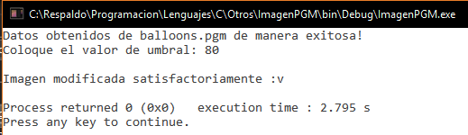
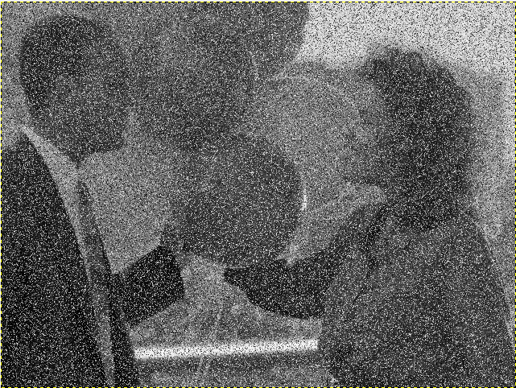

#Procesamiento de Imagenes (umbralización)

##Descripción

Un pequeño código realizado en C que permite cambiar imágenes con extensión *.pgm.

##Muestras

####Consola

 

####Imagen balloons.pgm

####Imagen de salida a umbral 80 (resultado.pgm)

